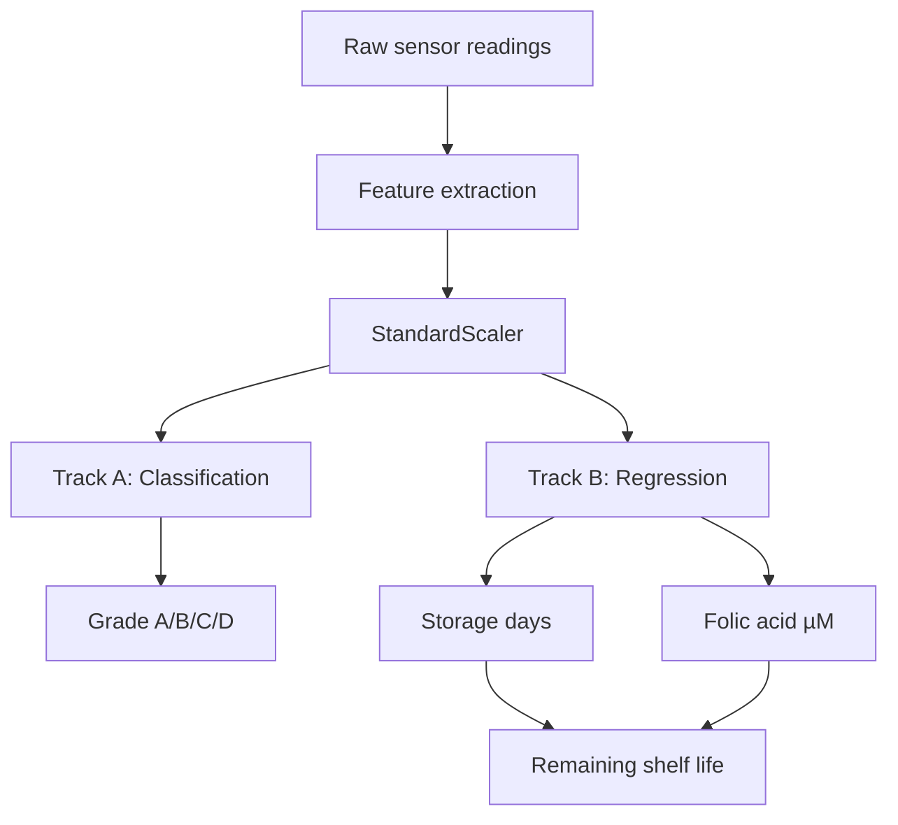

# Orange Freshness Detection System Using Electronic Tongue Sensor

## Chapter-by-Chapter Project Report

**Project Type:** Machine Learning based freshness assessment for oranges  
**Core Outputs:** Freshness grade, storage days, folic acid concentration, remaining shelf life

---

## Abstract

This project develops an electronic-tongue based machine learning system for non-destructive orange freshness assessment. The codebase uses sensor-derived features to solve two main prediction tasks: freshness grade classification and regression for storage days and folic acid concentration. A broader benchmarking layer compares multiple algorithms under different preprocessing strategies, and the final workflow serves predictions through inference scripts, an API, and a dashboard.

The strongest result in the repo is that simple raw preprocessing with StandardScaler usually outperforms more complex smoothing and feature-reduction pipelines. The system therefore favors a practical baseline approach for deployment while keeping the richer feature pipelines for experimentation and comparison.

---

## Chapter 1: Introduction

Fresh oranges change chemically and physically as they age. Manual freshness grading is subjective and inconsistent, so this project uses sensor data and machine learning to estimate freshness automatically.

The project is built around three practical questions:

1. Can freshness grade be predicted from sensor features?
2. Can storage day and folic acid concentration be predicted from the same sample?
3. Which preprocessing and algorithm choices give the best generalization?

The repo solves these questions with a dual-track machine learning design:

- Track A: classification of freshness grade A/B/C/D
- Track B: regression for storage days and folic acid concentration

---

## Chapter 2: Dataset Description

The project uses orange sensor data organized by batch and storage day.

### Main Dataset Files

- [datasets/master_all_batches.csv](datasets/master_all_batches.csv): raw sensor archive
- [datasets/X_features.csv](datasets/X_features.csv): baseline engineered features, 2,050 samples, 11 features
- [datasets/X_features_enhanced.csv](datasets/X_features_enhanced.csv): enhanced engineered features, 2,050 samples, 26 features
- [datasets/y_targets.csv](datasets/y_targets.csv): target table with `batch`, `day`, and `true_conc_uM`
- [datasets/key.csv](datasets/key.csv): folic acid key / metadata lookup
- [datasets/test_dataset_blind/](datasets/test_dataset_blind/): unseen blind-test CSVs for batches 6 and 7

### What the Data Represents

Each orange sample is associated with sensor readings and a storage day label. The code derives the freshness class from the day value:

- 0 to 3 days: Grade A
- 4 to 7 days: Grade B
- 8 to 10 days: Grade C
- greater than 10 days: Grade D

That rule is used consistently in [track_a_train_classifier.py](track_a_train_classifier.py), [stacking_ensemble_optimized.py](stacking_ensemble_optimized.py), [task2_enhanced_features_tournament.py](task2_enhanced_features_tournament.py), and [blind_test_evaluation.py](blind_test_evaluation.py).

### Dataset Shape and Splits

- Baseline feature matrix: 2,050 rows and 11 features
- Enhanced feature matrix: 2,050 rows and 26 features
- Blind-test set: 15 CSV files for batches 6 and 7
- Track A classification split: 80/20 stratified split
- Track B day regression split: batch-based train/test separation in the legacy workflow
- Folic acid regression split: smaller labeled subset from `true_conc_uM` or `key.csv`

---

## Chapter 3: Problem Statement and Objectives

The project is designed to predict orange freshness without destroying the sample.

### Objectives

1. Predict freshness grade from engineered sensor features.
2. Predict storage age in days.
3. Predict folic acid concentration in µM where labels exist.
4. Compare preprocessing methods and algorithms to find the strongest general-purpose model.
5. Provide deployable outputs through scripts, API, and dashboard utilities.

### Why This Matters

Freshness assessment affects sorting, storage, logistics, and consumer quality. A practical model can help automate grading and estimate spoilage risk earlier than manual inspection.

---

## Chapter 4: System Workflow

The workflow follows a clear pipeline from raw sensor readings to user-facing predictions.

### Step 1: Data Acquisition

Raw electronic tongue measurements are collected for each orange sample across batches and storage days.

### Step 2: Feature Extraction

The raw signals are converted into engineered features using signal-processing and statistical operations.

### Step 3: Preprocessing

The features are standardized, and in some experiments they are also smoothed, transformed, or reduced.

### Step 4: Model Training

Classification and regression models are trained and compared.

### Step 5: Evaluation

Models are measured using classification and regression metrics on held-out data.

### Step 6: Inference and Reporting

The best models are used by inference scripts, the REST API, the dashboard, and the blind-test evaluation script.

---

## Chapter 5: Feature Engineering

Feature engineering is one of the most important parts of the repo.

### Baseline Feature Set

[track_a_preprocessing.py](track_a_preprocessing.py) builds the original 11-feature representation using:

- Savitzky-Golay smoothing
- DCT coefficients
- Peak height
- Energy
- Statistical summaries such as mean, standard deviation, skewness, and kurtosis

### Enhanced Feature Set

[track_a_preprocessing_v2.py](track_a_preprocessing_v2.py) expands the representation with:

- Range
- Minimum value
- Coefficient of variation
- Gradient features
- Entropy

[generate_enhanced_features.py](generate_enhanced_features.py) further expands the CSV into a 26-feature table with interaction and polynomial-style features.

### Feature Selection

[track_a_feature_selection.py](track_a_feature_selection.py) applies Recursive Feature Elimination with Random Forest as the estimator. The classifier keeps the top 5 selected features for Track A in the legacy training path.

### Main Insight

The repo repeatedly shows that more features are not always better. In the tournament and blind-test results, raw standardized features often outperform the heavier smoothing and selection pipeline.

---

## Chapter 6: Track A - Freshness Grade Classification

Track A answers the question: what freshness grade does this orange belong to?

### Target

The output class is one of four grades:

- A: freshest
- B: good
- C: fair
- D: poor

### Legacy Classification Pipeline

[track_a_train_classifier.py](track_a_train_classifier.py) performs the following:

1. Load `X_features.csv` and `y_targets.csv`.
2. Impute missing values.
3. Scale the features with StandardScaler.
4. Split data into train and test sets.
5. Apply RFE to select the top 5 features.
6. Train a stacking classifier.
7. Evaluate accuracy, confusion matrix, and classification report.

### Classification Model Used

The stacking classifier uses:

- Base learner 1: Random Forest Classifier
- Base learner 2: SVM with RBF kernel
- Meta learner: Random Forest Classifier

### Tournament Classification Models

The benchmarking layer also evaluates:

- LDA
- SVM
- Random Forest
- XGBoost
- 1D-CNN

### Best Classification Result

The repo repeatedly identifies LDA with raw preprocessing as the strongest tournament winner, with approximately 78.05% accuracy in the reported results.

---

## Chapter 7: Track B - Regression for Storage Days

Track B answers the question: how old is the orange in storage days?

### Target

The day target ranges from 0 to 14.

### Regression Models

The main scripts use:

- SVR with RBF kernel
- Random Forest Regressor
- Stacking Regressor
- XGBoost Regressor in the tournament layer
- PLS Regression in the tournament layer

### Optimized Stacking Workflow

[stacking_ensemble_optimized.py](stacking_ensemble_optimized.py) builds a stacking regressor with:

- Base learner 1: SVR
- Base learner 2: Random Forest Regressor
- Meta learner: Ridge regression

The optimized configuration uses raw standardized features and tuned hyperparameters.

### Best Regression Result

The repository documents SVR with raw preprocessing as the best day-prediction model, with RMSE around 1.493 days and R² around 0.86.

---

## Chapter 8: Folic Acid Regression

The folic acid task is a specialized regression problem for predicting `true_conc_uM`.

### Data Availability

This target is only available for a smaller subset of the data. The code in [task3_folic_acid_stacking.py](task3_folic_acid_stacking.py) uses the labeled samples from `y_targets.csv` or merges with `key.csv` when needed.

### Model Structure

The folic acid stack uses the same general pattern as the day regressor:

- Base learner 1: SVR
- Base learner 2: Random Forest Regressor
- Meta learner: Ridge

### Practical Limitation

Because far fewer samples are labeled for folic acid than for freshness or days, this track is more data-limited and less central to the main deployment flow.

---

## Chapter 9: Tournament Benchmarking

The tournament framework is the project’s most systematic comparison layer.

### Purpose

It answers which algorithms and preprocessing choices perform best on the same dataset.

### Algorithms Compared

Classification:

- LDA
- SVM
- Random Forest
- XGBoost
- 1D-CNN

Regression:

- PLS
- SVR
- Random Forest
- XGBoost

### Preprocessing Methods Compared

1. Raw features + StandardScaler
2. Savitzky-Golay smoothing + DCT + RFE + StandardScaler

### Main Conclusion

The raw StandardScaler-only path consistently performs better than the advanced preprocessing path in this dataset. That is the strongest practical conclusion in the reports and scripts.

---

## Chapter 10: Inference, API, and Dashboard

### Inference API

[inference_api.py](inference_api.py) loads trained models and exposes:

- `predict_day()`
- `predict_folic_acid()`
- `predict_both()`

### Remaining Shelf-Life

[shelf_life.py](shelf_life.py) converts the predicted day and folic acid outputs into remaining shelf-life estimates using simple clipped heuristics and a folic-acid decay model.

### Dashboard and Visual Reporting

[presentation_dashboard.py](presentation_dashboard.py) generates visuals for:

- confusion matrix
- per-grade metrics
- regression fit quality
- selected feature importance
- architecture diagram

These outputs are meant for presentation and project defense, not for model training.

---

## Chapter 11: Results and Discussion

### Key Results Reported in the Repo

- Classification accuracy: about 78.05% for the best LDA raw configuration
- Regression RMSE: about 1.493 days for the best SVR raw configuration
- Stacking regression RMSE: about 1.4947 days
- Stacking classification accuracy: about 76.10%

### Interpretation

The project shows that simpler feature handling is often better for this sensor dataset. The signal already contains useful discriminative information, and aggressive smoothing or reduction can remove it.

The most important practical lesson is not just which model won, but why: the raw sensor features preserve the fine-grained variations needed to separate freshness classes and estimate age.

---

## Chapter 12: Conclusion

This project successfully builds a dual-track orange freshness detection pipeline using sensor data and machine learning. The codebase supports classification, regression, benchmarking, inference, reporting, and shelf-life estimation.

### Final Takeaways

1. The dataset is sensor-based, batch-structured, and target-rich.
2. Freshness grades are derived from storage days.
3. Raw standardized features are the strongest default choice.
4. LDA is the best classifier in the tournament results.
5. SVR is the best regressor for storage days in the reported results.
6. Stacking improves robustness, but not always beyond the simplest winner.

### Future Scope

- Retrain Track A using the enhanced 26-feature table
- Calibrate prediction confidence for deployment
- Add more labeled folic acid samples
- Validate more models on the blind test split
- Improve the dashboard with live prediction inputs

---

## Appendix: Main Files Used in the Workflow

- [track_a_preprocessing.py](track_a_preprocessing.py)
- [track_a_preprocessing_v2.py](track_a_preprocessing_v2.py)
- [track_a_feature_selection.py](track_a_feature_selection.py)
- [track_a_train_classifier.py](track_a_train_classifier.py)
- [stacking_ensemble_optimized.py](stacking_ensemble_optimized.py)
- [task3_folic_acid_stacking.py](task3_folic_acid_stacking.py)
- [tournament_director.py](tournament_director.py)
- [blind_test_evaluation.py](blind_test_evaluation.py)
- [inference_api.py](inference_api.py)
- [shelf_life.py](shelf_life.py)
- [presentation_dashboard.py](presentation_dashboard.py)
