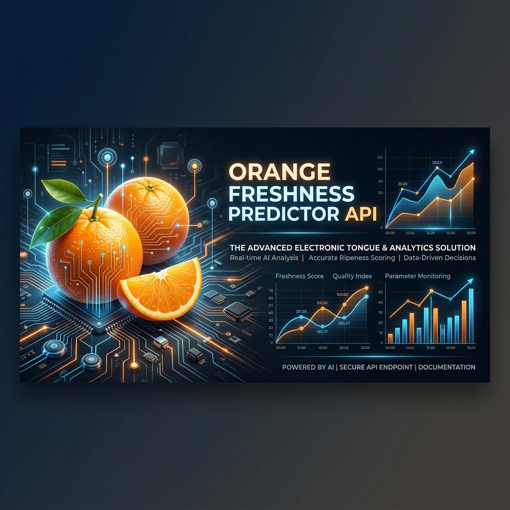
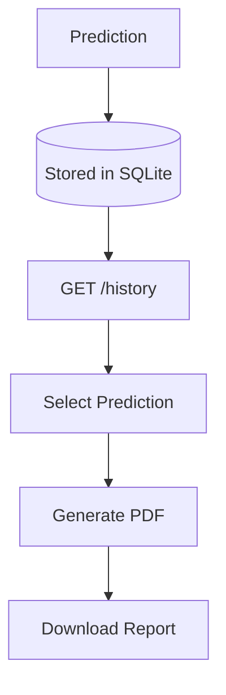
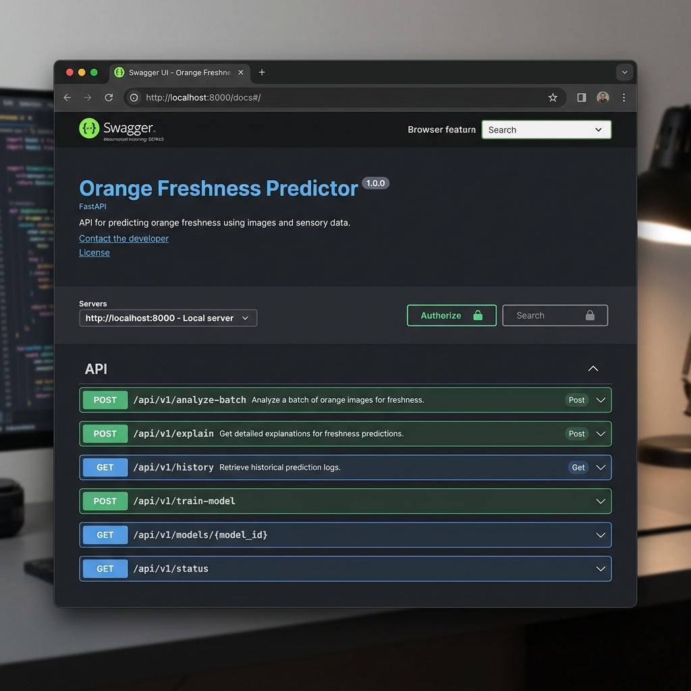
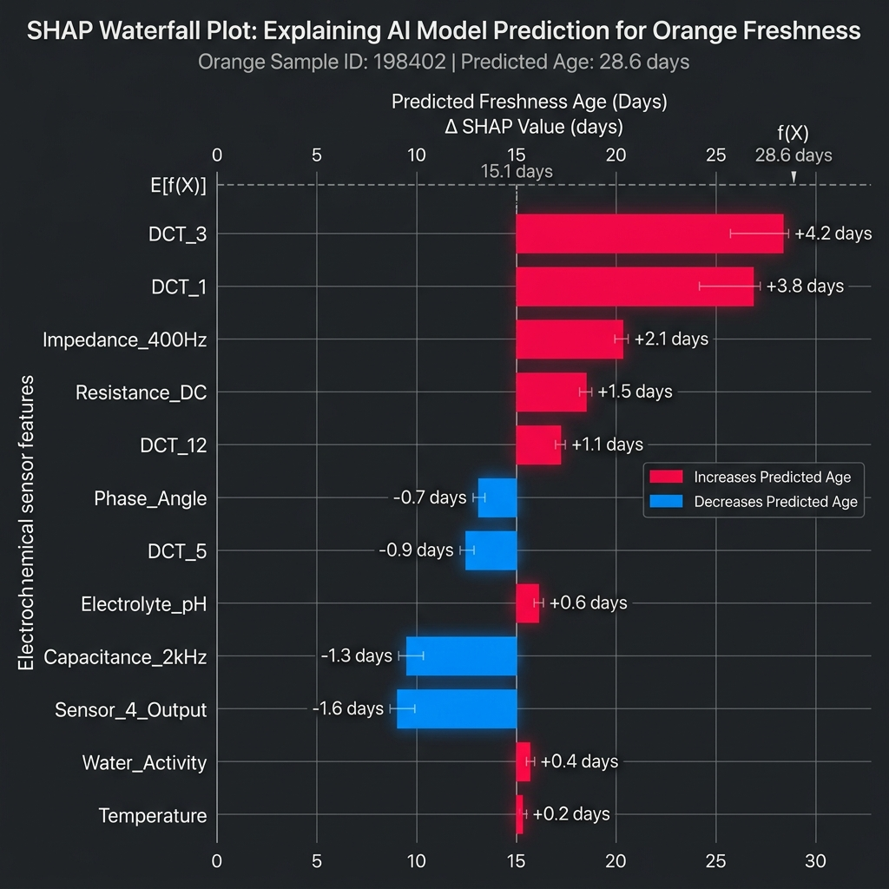

# Electronic Tongue Orange Freshness API



## 1. Project Overview

### Problem Statement
The agriculture and food storage industries face significant challenges in accurately assessing the freshness and nutritional quality of produce during storage. Traditional chemical analysis is destructive, expensive, and time-consuming.

### Motivation
Electronic tongue sensors provide rapid, non-destructive electrochemical readings. However, translating raw sensor potentials into actionable business metrics (like remaining shelf life and nutritional degradation) requires robust machine learning models capable of handling complex non-linear relationships.

### Solution
This project implements a high-performance **FastAPI Backend** that wraps two Scikit-Learn Random Forest models. The models ingest an 11-feature sensor array to simultaneously predict the **Storage Age (Days)** and **Folic Acid Concentration (μM)**. A comprehensive SHAP (SHapley Additive exPlanations) integration layer provides human-readable explanations of *why* the model made its predictions, fostering trust and operational transparency.

---

## 2. System Architecture

```mermaid
flowchart TD
    Client((Client)) -->|InferenceRequest| Router(FastAPI Router)
    Router -->|Validation| Endpoints(API Endpoints)
    
    subgraph Service Layer
        Endpoints --> GradingService[Grading Service]
        Endpoints --> ExplainService[Explain Service]
        Endpoints --> VisService[Visualization Service]
    end
    
    subgraph ML Engine Layer
        GradingService --> MLEngine[ML Engine Singleton]
        ExplainService --> MLEngine
        VisService --> ExplainService
        
        MLEngine --> Preprocessing[StandardScaler & RFE]
        Preprocessing --> DayModel[RandomForest: Day]
        Preprocessing --> FolicModel[RandomForest: Folic]
        
        DayModel --> SHAPDay[TreeExplainer: Day]
        FolicModel --> SHAPFolic[TreeExplainer: Folic]
    end

    MLEngine -->|Raw Arrays| Service Layer
    Service Layer -->|Pydantic Models| Router
    Router -->|JSON / PNG| Client
```

### Components
* **FastAPI Router**: Handles HTTP transport, request validation (via Pydantic), and Swagger UI generation.
* **Service Layer**: Translates raw ML outputs into business metrics (e.g., categorical freshness grades, feature ranking).
* **ML Engine Layer**: A thread-safe Singleton managing the lifecycle of Scikit-Learn `.pkl` models and SHAP `TreeExplainers`, guaranteeing zero-duplicate preprocessing and high concurrency throughput.

---

## 3. Project Structure

```text
backend/
├── app/
│   ├── api/
│   │   └── endpoints.py          # Thin REST controllers (/analyze-batch, /explain)
│   ├── core/
│   │   ├── config.py             # Model versioning and environment configs
│   │   ├── logging_config.py     # Production stdout logger
│   │   └── ml_engine.py          # ML Singleton and SHAP compute layer
│   ├── database/
│   │   ├── database.py           # Database connection and engine
│   │   └── models.py             # SQLAlchemy models for history tracking
│   ├── schemas/
│   │   ├── payload.py            # Strict Pydantic interface validations
│   │   └── history.py            # Pydantic schemas for prediction history
│   ├── services/
│   │   ├── csv_service.py        # CSV batch processing service
│   │   ├── data_service.py       # Services for fetching dataset, benchmarks
│   │   ├── decision_engine.py    # Advanced evaluation / multi-model orchestration
│   │   ├── explain_service.py    # Explanation formatting and feature ranking
│   │   ├── grading_service.py    # Business rules mapping days to freshness grades
│   │   ├── history_service.py    # CRUD operations for prediction history
│   │   ├── report_service.py     # PDF report assembly and generation
│   │   └── shap_visualization.py # Matplotlib visual generator for SHAP data
│   └── utils/
│       └── pdf_generator.py      # Low-level ReportLab PDF layouts
├── models/                       # Serialized Scikit-Learn artifacts
└── requirements.txt
frontend/                         # Vite + React Dashboard application
├── src/                          # Dashboard components and page layouts
├── package.json
└── vite.config.js
tests/                            # Pytest integration & unit testing suite
```

---

## 4. Technology Stack

* **Python 3.13** - Core runtime
* **FastAPI** - High-performance asynchronous web framework
* **Pydantic V2** - Strict data validation and settings management
* **scikit-learn** - Machine learning predictive modeling and preprocessing
* **SHAP** - Game-theoretic approach to explain model output
* **NumPy** - High-performance array computing
* **Matplotlib** - Headless generation of analytical plots
* **Joblib** - Efficient binary serialization of model artifacts
* **Pytest** - Automated testing suite

---

## 5. Features

* **Dual Prediction**: Simultaneously calculates estimated storage age and remaining folic acid levels.
* **Business Grading**: Automatically categorizes oranges into `A`, `B`, `C`, or `Reject` based on predicted shelf life.
* **Explainable AI (XAI)**: Full SHAP integration ranking the Top 3 contributing electrochemical features for every prediction.
* **Visual Diagnostics**: Dynamically generates Waterfall and Bar charts of the model's decision process directly over REST.
* **Production Observability**: Configured with strict JSON-compliant loggers capturing inference latency and batch identifiers.
* **Interactive Swagger UI**: Explore and test the API directly from the browser.

---

## 6. Installation

1. **Clone the repository:**
   ```bash
   git clone https://github.com/your-org/orange-freshness-api.git
   cd orange-freshness-api/backend
   ```

2. **Create a virtual environment:**
   ```bash
   python -m venv .venv
   source .venv/bin/activate  # On Windows: .venv\Scripts\activate
   ```

3. **Install dependencies:**
   ```bash
   pip install -r requirements.txt
   ```

4. **Run the server:**
   ```bash
   uvicorn app.main:app --reload --host 127.0.0.1 --port 8000
   ```

## Prediction History

The backend automatically stores a complete chronological log of all predictions generated by the ML engine. This observability layer significantly improves production readiness by enabling dataset drift monitoring, anomaly detection, audit tracing, and system health evaluation over time.

### Architecture
- **Service Layer (`history_service.py`)**: A pure SQLAlchemy ORM implementation exposing paginated lookups and atomic record commits.
- **Data Persistence**: Uses a lightweight SQLite database (`prediction_history.db`) automatically generated at FastAPI startup.
- **Resiliency**: Database calls are wrapped in robust fault-tolerant exception handling (`try/except SQLAlchemyError`), guaranteeing that a database lock or failure will **never** interrupt or crash the primary prediction endpoints.

### Database Schema
Every inference request records the following into the `prediction_history` table:
- `id`: Auto-incrementing primary key.
- `batch_id`: A reference ID provided by the client.
- `request_json`: The complete original JSON payload from the request.
- `response_json`: The complete final JSON payload returned to the client.
- `prediction_days`: ML output for estimated age.
- `freshness_grade`: Final categorical freshness grade.
- `confidence`: Calculated confidence score.
- `storage_temperature`: The storage temperature provided for context.
- `model_version`: Tracks the active inference version.
- `latency_ms`: Total latency taken to perform the inference.
- `created_at`: UTC timestamp.

### Endpoints

**1. `GET /api/v1/history`**
Retrieves a paginated list of all stored predictions, ordered newest first.

**Pagination Example:**
```bash
curl "http://127.0.0.1:8000/api/v1/history?page=2&page_size=20"
```
**Sample Response:**
```json
{
  "page": 2,
  "page_size": 20,
  "total_records": 105,
  "total_pages": 6,
  "predictions": [
    {
      "id": 85,
      "batch_id": "test-batch-85",
      "prediction_days": 4.5,
      "freshness_grade": "A",
      ...
    }
  ]
}
```

**2. `GET /api/v1/history/{id}`**
Retrieves the complete payload stringification and logs for a specific prediction ID. Returns `404 Not Found` if missing.

**3. `DELETE /api/v1/history/{id}`**
Deletes a stored prediction. Returns `204 No Content` on success, or `404 Not Found` if missing.

---

## Prediction Report Export

The backend includes a specialized service for generating professional, printable PDF reports from historical prediction data. 

### Flow



### Endpoints

**`GET /api/v1/history/{id}/report`**
Dynamically generates a PDF report for a specific prediction ID. Returns an `application/pdf` binary stream triggering an automatic file download.

**Sample Request:**
```bash
curl -O -J "http://127.0.0.1:8000/api/v1/history/7/report"
```

**Sample Response:**
*Returns a binary `application/pdf` file named `prediction_report_7.pdf`.*

### Report Contents
The generated PDF report includes:
- **Header**: Prediction ID, Batch ID, Model Version, and Timestamps.
- **Batch Information**: Storage temperature and tabular sensor readings.
- **Prediction Summary**: Semantic freshness status (color-coded), estimated age, and confidence percentage.
- **Top Influential Features (Optional)**: If SHAP explanation data exists, a ranking of the most impactful features is included.

### Screenshots


### Why On-Demand Generation?
Generating PDFs dynamically on-demand provides significant architectural advantages over pre-generating and storing them in the database or object storage:
- **Zero Storage Overhead**: Eliminates the need to manage file storage (like AWS S3) or bloat the SQLite database with large BLOB objects.
- **Backwards Compatibility**: If the report's visual styling or layout is updated in the future, fetching an old historical prediction will automatically render it using the new, improved layout.
- **State Consistency**: Generating directly from the stored `request_json` and `response_json` ensures the report is always a 100% accurate reflection of the mathematical inference performed at that exact moment.

---

## 7. API Documentation

Once the server is running, visit `http://127.0.0.1:8000/docs` to interact with the **Swagger UI**.

### `POST /api/v1/analyze-batch`
Standard inference endpoint. Returns freshness grading and estimated shelf life.
**Request Example:**
```json
{
  "batch_id": "batch-8472",
  "sensor_readings": [1.0, 2.0, 3.0, 4.0, 5.0, 6.0, 7.0, 8.0, 9.0, 10.0, 11.0]
}
```

### `POST /api/v1/explain`
Returns predictions mapped alongside SHAP-calculated feature importances.
**Response Highlight:**
```json
"explanation": {
  "day_model": {
    "base_value": 6.84,
    "top_features": [
      {
        "rank": 1,
        "feature_name": "DCT_3",
        "shap_value": -3.64,
        "absolute_importance": 3.64,
        "impact": "decrease"
      }
    ]
  }
}
```

### `POST /api/v1/explain/visualize`
Returns a `image/png` buffer rendering the mathematical decision boundary.
Accepts Query Parameters: `?model=day&plot_type=waterfall`

### `POST /api/v1/analyze-csv`
Upload a CSV file containing rows of electrochemical readings to generate batch predictions.
Supports query parameters `preprocessing_strategy` ("raw" or "advanced") and `storage_temperature_c`.

### `WS /api/v1/ws/live-predict`
Establish a WebSocket connection for low-latency live streaming predictions. Broadcast sensor array readings frames to receive instant age predictions, freshness grades, remaining shelf life, and temperature alerts.

### `GET /api/v1/history/stats`
Retrieves aggregate metrics and analytics across the history of predictions (e.g., total runs, grade distributions).

### `GET /api/v1/dataset`
Fetch paginated dataset records for browsing historical sensor data.

### `GET /api/v1/models/benchmark`
Fetch model details, parameters, evaluation metrics (like Mean Absolute Error, R² score).

### `GET /api/v1/hardware/simulate`
Simulate a hardware scan. Returns 11 realistic sensor readings selected at random from the validation dataset.

---

## 8. SHAP Explainability

**What is SHAP?**
SHAP (SHapley Additive exPlanations) is a game-theoretic approach to explaining the output of any machine learning model. It connects optimal credit allocation with local explanations using the classic Shapley values from cooperative game theory.

**Why is it used?**
Random Forests are powerful but notoriously "black box" in nature. SHAP opens the box by explicitly attributing a numerical value to each input feature, calculating exactly how much that feature pushed the prediction away from the model's average base expectation.

**How to Interpret the Visualizations:**
* **Waterfall Plots:** Start from the bottom (the `base_value` representing the average prediction over the training set). Each row shows a feature adding to (red) or subtracting from (blue) the prediction until reaching the final `f(x)` output at the top.
* **Bar Plots:** A simpler magnitude-based ranking. Longer bars represent features that had a higher absolute impact on the current specific prediction.

---

## 9. Screenshots

*Swagger UI Documentation*


*SHAP Waterfall Plot*


---

## 10. Running Tests

The application is heavily tested using `pytest`. The suite covers protocol validations, schema enforcements, mock-injections, and calculation logic.

```bash
cd ..
pytest tests/ -v
```

---

## 11. Future Improvements

* **Batch Explainability Endpoint:** Support lists of 2D sensor readings utilizing `.shap_values()` batch arrays to handle entire shipments in a single call.
* **Continuous Model Retraining Pipeline:** Integrate a DAG scheduler (like Airflow or Prefect) to periodically retrain the `.pkl` models to handle data drift and eliminate scikit-learn versioning warnings.
* **Containerization:** Wrap the backend inside a lightweight `Dockerfile` for seamless Kubernetes deployment.
* **Monitoring:** Hook the custom python `logger` into Prometheus and Grafana for real-time latency and prediction distribution tracking.

---

## 12. Frontend Dashboard

The repository includes a modern React dashboard powered by Vite, providing a visual control panel and analytics layer for the Orange Freshness Predictor.

### Features
* **Interactive Inference Simulator**: Manually input electrochemical sensor readings or trigger a mock hardware scan to predict storage age, remaining shelf life, and grade.
* **History Log & PDF Download**: View a paginated grid of all prediction history records and download on-demand PDF reports directly.
* **Dataset Explorer**: Paginated tabular explorer of the underlying training/testing data.
* **Model Benchmarks**: Visual summary of RandomForest model performance metrics (MAE, R², RFE rankings).

### Run Locally
1. **Navigate to the frontend directory:**
   ```bash
   cd frontend
   ```
2. **Install dependencies:**
   ```bash
   npm install
   ```
3. **Start the development server:**
   ```bash
   npm run dev
   ```
