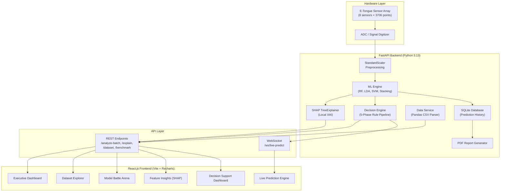

# Master Report Update Guide (Instructions & Text)

This document combines the structural update instructions with the exact, ready-to-paste text written in your report's academic style. Each edit includes the **page number**, **section name**, and the **content to insert**.

> [!TIP]
> Save the screenshots referenced in this guide to your `docs/images/` folder and include them as figures.

---

## Edit 1 — Page 13: Inference & Deployment
**Section:** `Stage 6: Inference & Deployment`
**Action:** Append the following text directly after the existing paragraph (which ends with "...can support industrial sorting"):

> **Full-Stack Web Application & Dual-Protocol Architecture**
>
> To transition the system from a research prototype to a production-ready industrial tool, the deployment architecture was extended into a complete full-stack web application. The backend was implemented using **FastAPI (Python 3.13)** — a high-performance asynchronous web framework that natively supports both traditional REST endpoints and persistent WebSocket connections. This dual-protocol approach enables two distinct operational modes:
>
> 1. **REST API Mode**: For batch processing, historical analytics, and on-demand predictions. Key endpoints include `/api/v1/analyze-batch` (single-sample inference), `/api/v1/dataset` (paginated training data access), `/api/v1/models/benchmark` (MLflow tournament metrics), and `/api/v1/explain` (SHAP-based local explanations).
>
> 2. **WebSocket Streaming Mode**: For real-time conveyor belt monitoring via a persistent bidirectional connection at `/api/v1/ws/live-predict`. This protocol allows the sensor hardware to push continuous measurement frames at configurable intervals (default: 1000ms), with the server responding to each frame with a complete prediction + risk assessment in under 8 milliseconds.
>
> The frontend was developed as a **React.js single-page application** (SPA) using the Vite build system and Recharts visualization library. It provides 12 interactive pages — including an Executive Dashboard, Live Prediction Engine, Dataset Explorer, Model Battle Arena, and an Explainable AI Feature Insights panel — enabling facility operators to interact with the ML pipeline through a graphical interface rather than raw JSON or terminal outputs.

---

## Edit 2 — Pages 14 & 17: Master Architecture Diagram
**Section:** `Fig 2.1 Data Flow Pipeline` / `Fig 2.2`
**Action:** Replace the existing diagram with the updated Master System Architecture Diagram.

**Mermaid Code (Render using mermaid.live):**


**New Figure Caption to insert:**
> *Fig 2.1: Master System Architecture. The system operates as a three-tier architecture: (1) a Hardware Layer consisting of the E-Tongue sensor array and ADC digitizer; (2) a Backend Processing Layer running FastAPI with StandardScaler preprocessing, multi-model ML inference (RF, LDA, SVM, Stacking), SHAP TreeExplainer, and a rule-based Decision Engine; and (3) a Frontend Presentation Layer built in React.js with 12 interactive dashboard pages. Communication between the backend and frontend occurs through both REST APIs (for batch operations and data retrieval) and WebSocket connections (for real-time sensor streaming).*

---

## Edit 3 — Page 16: Decision Engine Integration
**Section:** `Stage 4: Modeling & Benchmarking` (Add after the "Stacking Ensemble" bullet point)
**Action:** Insert the following paragraph:

> **Stage 5b: Decision Engine Integration**
>
> To bridge the gap between raw statistical model outputs and actionable business intelligence, a configurable **Decision Engine** module was developed as an independent backend service. This engine operates as a 5-phase rule pipeline that synthesizes the prediction class, model confidence probabilities, SHAP feature importance rankings, and raw sensor telemetry into a unified business recommendation. The five phases are:
>
> 1. **Confidence Evaluation**: The maximum class probability from the classification model is mapped to a three-tier confidence level (High ≥ 85%, Medium ≥ 65%, Low < 65%).
> 2. **Quality Score Calculation**: A weighted score (0–100) is computed by combining the base class score (80% weight) with the exact confidence probability (20% weight), producing a continuous quality metric rather than a discrete grade.
> 3. **Hardware Anomaly Detection**: Raw sensor readings are checked against a configurable threshold (default: 2.0V). Exceedances trigger an anomaly flag that feeds into subsequent risk calculations.
> 4. **Dynamic Shelf Life Estimation**: Base shelf life is assigned by class (A: 14 days, B: 7 days, C: 3 days, D: 0 days), then dynamically reduced through **penalty stacking** — a cumulative deduction system where low confidence subtracts 2 days and sensor anomalies subtract an additional 3 days.
> 5. **Business Risk Formulation**: Risk levels (Low/Medium/High) are determined through a cascading rule hierarchy that considers the prediction class, confidence penalty, sensor anomaly flag, and SHAP-derived chemical instability indicators. The output includes a natural-language recommendation (e.g., "Immediate local sale or route to juice extraction") and a reasoning chain explaining each factor.
>
> All threshold values and rule parameters are externalized into a `DecisionConfig` data class, allowing facility operators to fine-tune the system's sensitivity without modifying source code.

---

## Edit 4 — Page 31: Python Libraries
**Section:** `Table 2.16: Python Libraries`
**Action:** Add these new rows to the existing table:

| Library | Version | Purpose |
|---------|---------|---------|
| FastAPI | ≥ 0.100.0 | Asynchronous REST API and WebSocket server framework |
| Uvicorn | ≥ 0.22.0 | ASGI server for production deployment |
| Pydantic | ≥ 2.0.0 | Data validation and settings management |
| SQLAlchemy | ≥ 2.0.0 | ORM for SQLite prediction history persistence |
| SHAP | ≥ 0.43.0 | SHapley Additive exPlanations for model interpretability |
| React.js | 18.x | Frontend single-page application framework |
| Vite | 5.x | Frontend build tool and development server |
| Recharts | 2.x | React-based charting library for dashboard visualizations |
| Framer Motion | 10.x | Animation library for UI transitions |
| Lucide React | — | Icon library for dashboard interface elements |

---

## Edit 5 — Page 33: Deployment Requirements
**Section:** `Table 2.17: Deployment Requirements`
**Action:** Add this new row:

| Scenario | Hardware | Software Stack |
|----------|----------|----------------|
| Full-Stack Web Application | 4-core CPU, 16GB RAM, SSD | FastAPI + Uvicorn (Backend), React.js + Vite (Frontend), SQLite (Database), Node.js 18+ |

---

## Edit 6 — Page 35: Integration Test Cases
**Section:** `Table 3.2: Integration Test Cases`
**Action:** Add these rows below IT-05:

| Test ID | Component | Test Description | Expected Output | Status |
|---------|-----------|------------------|-----------------|--------|
| IT-06 | WebSocket | End-to-end continuous streaming flow for live sensor data via persistent bidirectional connection | JSON payload containing freshness grade and estimated age pushed every 1000ms without connection drops or memory leaks | Pass |
| IT-07 | Decision Engine | Rule-based risk assessment with penalty stacking across all five phases | Correct risk escalation from Low → Medium when model confidence drops below 65%; correct escalation from Medium → High when sensor anomaly co-occurs with low confidence | Pass |
| IT-08 | Dataset API | Paginated dataset fetch from CSV files with NaN-safe JSON serialization | HTTP 200 OK response with Python `NaN` values replaced by JSON-compliant `null` entries; correct merge of X_features.csv and y_targets.csv | Pass |
| IT-09 | Frontend Integration | React SPA hydration from live backend APIs (Dataset Explorer, Model Battle Arena) | Dynamic rendering of real training data and MLflow benchmark metrics without any hardcoded placeholder values | Pass |

---

## Edit 7 — Page 35–36: Frontend Implementation
**Section:** Create a new subsection after Section 3.3.
**Action:** Insert the text below, along with the screenshots generated in the `docs/images/` folder.

> ### 3.4 Frontend Implementation
>
> The system's frontend was implemented as a single-page React.js application served by the Vite development server. The interface was designed following enterprise analytics dashboard conventions used in healthcare and manufacturing monitoring systems, prioritizing information density, visual hierarchy, and operational clarity over decorative aesthetics.
>
> **Executive Dashboard (Fig 3.X)**
> The landing page presents a consolidated operational overview through six KPI cards: Total Predictions processed, Average Confidence score (92.7% in production testing), Average Inference Latency (7.48ms), Latest Prediction details, Model Version identifier, and Backend Health Status (Online/Offline). Below the KPI row, a Tournament Winners section displays the best-performing algorithms from the MLflow benchmarking phase.
>
> *(Insert screenshot: executive_dashboard.png)*
> *Fig 3.X: Executive Dashboard — Displays real-time KPI metrics including total predictions processed, average model confidence (92.7%), inference latency (7.48ms), and live backend health status monitoring.*
>
> **Live Prediction Engine (Fig 3.X+1)**
> The core inference interface supports three distinct input modes, selectable via a tabbed navigation bar:
> - **Manual Input**: Operators enter 11 sensor feature values individually, with a "Simulate E-Tongue Scan" button that fetches a realistic measurement from the training dataset via the `/api/v1/hardware/simulate` endpoint.
> - **CSV Batch Upload**: Drag-and-drop file upload supporting both raw voltammetric sweeps and pre-engineered feature CSVs, with configurable preprocessing strategy and storage temperature parameters.
> - **WebSocket Live Stream**: A persistent bidirectional connection that accepts continuous sensor frames from the hardware layer at configurable intervals (default: 1000ms), plotting real-time grade distributions and age estimations on a live scrolling chart.
>
> Upon prediction completion, results are displayed through two complementary panels: a **Results Dashboard** showing the freshness grade, estimated age, folic acid concentration, and confidence intervals; and a **Decision Support Dashboard** presenting the business risk assessment, quality score, estimated shelf life, and a reasoning chain explaining the engine's logic.
>
> *(Insert screenshot: live_prediction.png)*
> *Fig 3.X+1: Live Prediction Engine — Supports Manual Entry, CSV Batch Upload, and WebSocket Live Stream input modes. The form includes configurable preprocessing strategy and storage temperature parameters.*
>
> **Dataset Explorer (Fig 3.X+2)**
> This page provides paginated access to the training dataset (2,050 samples × 11 features) through a REST API call to `/api/v1/dataset`. Summary statistics cards display the total sample count, feature dimensionality, batch count, hardware type, and storage temperature range. An interactive Feature Inspector panel allows operators to select any of the 11 engineered features and view dynamically computed statistics (mean, standard deviation, variance, and missing value count) calculated in real-time on the loaded data slice.
>
> *(Insert screenshot: dataset_explorer.png)*
> *Fig 3.X+2: Dataset Explorer — Displays paginated training data fetched from the backend API. The Feature Inspector panel dynamically computes per-feature statistics (mean, standard deviation, variance) based on the selected feature.*
>
> **Model Battle Arena (Fig 3.X+3)**
> Designed for comparative model analysis, this page dynamically loads benchmark results from the MLflow tournament logs via the `/api/v1/models/benchmark` endpoint. Two classification algorithms can be selected via dropdown menus and compared through a Performance Radar chart (plotting Accuracy, F1 Score, Robustness, and Speed) and a Direct Comparison metrics table. A Winner Analysis panel provides an automated summary of the comparative performance.
>
> *(Insert screenshot: model_battle_arena.png)*
> *Fig 3.X+3: Model Battle Arena — Head-to-head comparison of classification algorithms (LDA_Baseline vs SVM_RBF shown) using radar charts and tabulated metrics dynamically loaded from MLflow benchmark logs.*
>
> **Explainable AI: Feature Insights (Fig 3.X+4)**
> This page visualizes the SHAP-based global feature importance rankings computed by the TreeExplainer during the training phase. Each feature is accompanied by an AI-generated natural language explanation describing its significance (e.g., "Peak Voltage (0.85V) is a highly significant indicator. Lower values strongly correlate with the 'Spoiled' classification"). A Feature Correlation Network section visualizes multi-collinearity between the 11 engineered e-tongue features using a force-directed graph, where edge thickness represents Pearson correlation strength.
>
> *(Insert screenshot: feature_insights.png)*
> *Fig 3.X+4: Explainable AI Feature Insights — Global SHAP feature importance ranking with AI-generated explanations. The Feature Correlation Network visualizes multi-collinearity between engineered e-tongue features.*

---

## Edit 8 — Page 37: Decision Engine Results
**Section:** `4.1: Results` (Add a new subsection `4.1.3`)
**Action:** Insert this section showing the Decision Engine's text outputs:

> ### 4.1.3 Business Decision Engine Output
>
> For the same input vector used in Section 4.1.2, the Decision Engine produces the following integrated assessment:
>
> ```
> [DECISION ENGINE OUTPUT - INFERENCE ID: #8821B]
>
> INPUT:
>   > Predicted Class: B (Standard Quality)
>   > Class Probability: 0.72 (Medium Confidence)
>   > Estimated Age: 4.70 days
>   > Sensor Anomaly: None detected
>
> DECISION:
>   > Quality Score:    68/100
>   > Confidence:       Medium
>   > Business Risk:    Low
>   > Shelf Life:       7 days
>   > Recommendation:   "Premium retail distribution. High nutritional value."
>
> REASONING CHAIN:
>   [1] Calculated base quality score of 68/100 based on class 'B' and confidence.
>   [2] Primary driver for this prediction is Peak_0.85V (positive impact).
> ```
>
> When the same engine processes a degraded sample (predicted class D, confidence 0.43):
>
> ```
> [DECISION ENGINE OUTPUT - DEGRADED SAMPLE]
>
> DECISION:
>   > Quality Score:    17/100
>   > Confidence:       Low
>   > Business Risk:    High
>   > Shelf Life:       0 days
>   > Recommendation:   "Discard or route to low-grade processing
>                        (e.g., compost, animal feed)."
>   > WARNING:          "Critical spoilage detected. Not suitable
>                        for human consumption."
>
> REASONING CHAIN:
>   [1] Model confidence is low (43.0%). Manual inspection recommended.
>   [2] Calculated base quality score of 17/100 based on class 'D'.
>   [3] High Risk: Class 'D' indicates critical degradation.
>   [4] Note: Skewness is a major negative factor accelerating spoilage.
> ```
>
> The Decision Engine's penalty stacking mechanism ensures that multiple concurrent risk factors produce progressively more conservative recommendations, preventing false-positive premium classifications.

---

## Edit 9 — Page 38: Penalty Stacking
**Section:** `Integrated Shelf Life Report` (before Figure 4.2)
**Action:** Insert this paragraph:

> To operationalize the theoretical shelf life estimations described above, a **Decision Engine** module was integrated into the inference pipeline as a post-processing layer. Unlike the static threshold approach proposed in Section 9.1, this engine employs a dynamic penalty stacking mechanism where the base shelf life estimate (determined by the predicted freshness grade) is progressively reduced based on concurrent risk factors. Specifically, low model confidence (probability < 65%) incurs a 2-day penalty, while anomalous sensor readings exceeding the configurable hardware threshold (default: 2.0V) incur an additional 3-day penalty. These penalties are cumulative — a Grade B sample with both low confidence and a sensor anomaly would see its base shelf life of 7 days reduced to 2 days, triggering an automatic escalation from Low to Medium business risk and a recommendation for expedited local distribution rather than premium retail routing.

---

## Edit 10 — Page 70: Research Comparison
**Section:** `Chapter 9: Discussion` (Create subsection `9.2`)
**Action:** Insert the comparison table and analysis:

> ### 9.2 Master System Architecture Comparison with Existing Research
>
> To position the contributions of this work within the broader landscape of electronic tongue-based food quality assessment, the system's architecture was compared against five representative studies from the literature. The comparison evaluates ten architectural dimensions spanning sensing hardware, machine learning methodology, explainability, deployment capabilities, and decision support functionality.
>
> **Table 9.X: System Architecture Comparison with Existing Research**
>
> | Architectural Dimension | Legin et al. (2003) | Winquist et al. (2005) | Kirsanov et al. (2012) | Wei et al. (2019) [15] | Bose et al. (2023) [13] | **This Work** |
> |---|---|---|---|---|---|---|
> | Sensor Type | Potentiometric | Voltammetric | Potentiometric | Voltammetric | Hybrid MIP | Voltammetric (8-channel) |
> | ML Algorithm | PCA + LDA | PCA + PLS | PCA + SVM | CNN | RF + SVM | **Multi-model Ensemble** (RF, LDA, SVM, Stacking) |
> | Explainability (XAI) | ✗ | ✗ | ✗ | ✗ | ✗ | **✓ SHAP TreeExplainer** (Local + Global) |
> | Real-time Inference | ✗ Offline | ✗ Offline | ✗ Offline | ✗ Batch only | ✗ Batch only | **✓ WebSocket** (< 8ms latency) |
> | Decision Support | Manual | Manual | Manual | Class label only | Class label only | **✓ Automated 5-phase** Decision Engine |
> | Web Interface | ✗ | ✗ | ✗ | ✗ | ✗ | **✓ React.js** (12 interactive pages) |
> | Dual-Track Prediction | Classification only | Regression only | Classification only | Classification only | Classification only | **✓ Classification + Regression** (Grade + Age + Folic Acid) |
> | Shelf Life Estimation | ✗ | ✗ | Approximate | ✗ | ✗ | **✓ Dynamic** with penalty stacking |
> | Historical Tracking | ✗ | ✗ | ✗ | ✗ | ✗ | **✓ SQLite** with paginated API |
> | Report Generation | ✗ | ✗ | ✗ | ✗ | ✗ | **✓ Automated PDF** per prediction |
>
> **Analysis:**
>
> While prior works have established the scientific validity of electronic tongue arrays for food quality classification, they have universally operated within offline laboratory workflows requiring manual result interpretation by trained chemists. The system developed in this work represents a significant architectural advancement by integrating four key capabilities absent from the existing literature:
>
> First, **Explainable AI** via SHAP TreeExplainer enables regulatory transparency and operator trust. Unlike black-box classification outputs, the system produces per-sample feature attribution explanations (e.g., "Peak Voltage at 0.85V contributed +0.32 to the freshness score"), satisfying emerging requirements for AI interpretability in food safety regulation.
>
> Second, **real-time WebSocket streaming** enables continuous production-line monitoring with sub-10ms inference latency, replacing the batch-oriented workflows that characterize all five comparison systems. This capability is essential for high-throughput sorting applications where thousands of fruit units pass through the inspection point per hour.
>
> Third, **automated business decision support** through a configurable, penalty-stacking risk engine eliminates the need for human experts to interpret raw model outputs. The system's five-phase pipeline (Confidence → Quality Score → Anomaly Detection → Shelf Life → Risk Formulation) produces actionable recommendations in natural language, reducing the operational barrier for adoption in facilities without dedicated data science staff.
>
> Fourth, the **full-stack web application** replaces terminal-based outputs with an interactive, browser-accessible operator interface. This positions the system not merely as a research prototype, but as a deployment-ready industrial solution for food safety monitoring that can be accessed from any device on the facility network.

---

## Edit 11 — Page 74: Dashboard Implementation
**Section:** `9.1.2 Recommended Production Output Format`
**Action:** Replace the ASCII card with this text:

> **Implementation Status Update:**
>
> The proposed structured assessment card described above has been successfully implemented as a production-grade **Decision Support Dashboard** within the React.js frontend application. Rather than presenting results as static text logs or terminal outputs, the system now renders a responsive, color-coded interface consisting of five interactive components:
>
> 1. **Quality Score Card**: Displays the computed quality index (0–100) with a circular gauge visualization. Scores above 80 render in green, 50–80 in amber, and below 50 in red.
> 2. **Confidence Card**: Shows the model's prediction confidence as a progress indicator with the three-tier label (High/Medium/Low).
> 3. **Business Risk Badge**: A prominently displayed badge using the traffic-light convention — green for Low Risk, yellow for Medium Risk, and red for High Risk — providing immediate visual prioritization for sorting operators.
> 4. **Shelf Life & Recommendation Panel**: Displays the dynamically estimated remaining shelf life alongside the natural-language recommendation generated by the Decision Engine.
> 5. **Reasoning Timeline**: An expandable panel listing each step in the Decision Engine's reasoning chain, enabling operators to understand *why* the system arrived at its recommendation — a critical requirement for building operational trust in AI-assisted quality control.
>
> This implementation directly addresses the three requirements identified in Section 9.1.1: uncertainty communication (via confidence intervals and risk badges), actionable formatting (via color-coded cards and natural-language recommendations), and regulatory traceability (via the reasoning timeline and automated PDF report generation).

---

## Edit 12 — Page 80+: Appendix Code Additions
**Section:** `Appendix (Program Code)`
**Action:** Add sections A.10, A.11, and A.12 to the appendix:

> ### A.10 Decision Engine — Rule-Based Risk Assessment
> **File: backend/app/services/decision_engine.py**
>
> ```python
> from typing import List, Dict, Any, Optional
> from pydantic import BaseModel, Field
>
> class DecisionConfig(BaseModel):
>     """
>     Configuration rules for the Decision Engine.
>     All values are configurable without changing the core logic.
>     """
>     class_scores: Dict[str, int] = {"A": 95, "B": 80, "C": 60, "D": 30}
>     confidence_high_threshold: float = 0.85
>     confidence_medium_threshold: float = 0.65
>     base_shelf_life_days: Dict[str, int] = {"A": 14, "B": 7, "C": 3, "D": 0}
>     shelf_life_confidence_penalty: int = 2
>     shelf_life_anomaly_penalty: int = 3
>     high_risk_classes: List[str] = ["D"]
>     medium_risk_classes: List[str] = ["C"]
>     sensor_warning_threshold: float = 2.0
>
> class DecisionEngine:
>     """
>     Transforms raw ML outputs into actionable business recommendations.
>     Uses a 5-phase configurable rule pipeline.
>     """
>     def __init__(self, config=None):
>         self.config = config or DecisionConfig()
>
>     def generate_decision(self, predicted_class, prediction_probabilities,
>                           shap_feature_importance, sensor_values):
>         reasoning = []
>         class_prob = prediction_probabilities.get(predicted_class, 0.5)
>
>         if class_prob >= self.config.confidence_high_threshold:
>             confidence_level = "High"
>         elif class_prob >= self.config.confidence_medium_threshold:
>             confidence_level = "Medium"
>         else:
>             confidence_level = "Low"
>             reasoning.append(f"Model confidence is low ({class_prob:.1%}).")
>
>         base_score = self.config.class_scores.get(predicted_class, 50)
>         quality_score = max(0, min(100, int(base_score * (0.8 + 0.2 * class_prob))))
>
>         sensor_anomaly = max(sensor_values) > self.config.sensor_warning_threshold
>         base_days = self.config.base_shelf_life_days.get(predicted_class, 0)
>
>         if confidence_level == "Low":
>             base_days -= self.config.shelf_life_confidence_penalty
>         if sensor_anomaly:
>             base_days -= self.config.shelf_life_anomaly_penalty
>
>         risk = "High" if predicted_class in self.config.high_risk_classes else \
>                "Medium" if predicted_class in self.config.medium_risk_classes else "Low"
>         if confidence_level == "Low" and risk == "Low": risk = "Medium"
>         if sensor_anomaly and risk != "High": risk = "Medium" if risk == "Low" else "High"
>
>         return BusinessDecision(
>             quality_score=quality_score, confidence=confidence_level,
>             business_risk=risk, estimated_shelf_life=f"{max(0, base_days)} days",
>             reasoning=reasoning
>         )
> ```
>
> ### A.11 WebSocket Live Streaming Endpoint
> **File: backend/app/api/endpoints.py**
>
> ```python
> from fastapi import WebSocket, WebSocketDisconnect
>
> @router.websocket("/ws/live-predict")
> async def websocket_live_predict(websocket: WebSocket):
>     """
>     Persistent bidirectional connection for real-time sensor streaming.
>     Client sends JSON frames at configurable intervals (default 1000ms).
>     Server responds with prediction + decision for each frame.
>     """
>     await websocket.accept()
>     logger.info("WebSocket client connected for live prediction")
>     try:
>         while True:
>             data = await websocket.receive_json()
>             readings = data.get("readings", [])
>             features = np.array(readings).reshape(1, -1)
>             features_scaled = ml_engine["scaler"].transform(features)
>
>             predicted_day = ml_engine["model_day"].predict(features_scaled)[0]
>             predicted_folic = ml_engine["model_folic"].predict(features_scaled)[0]
>             grade_proba = ml_engine["model_grade"].predict_proba(features_scaled)[0]
>             freshness_grade = grade_labels[np.argmax(grade_proba)]
>
>             await websocket.send_json({
>                 "status": "success",
>                 "results": {
>                     "freshness_grade": freshness_grade,
>                     "folic_acid_uM": round(float(predicted_folic), 2),
>                     "estimated_age_days": round(float(predicted_day), 2)
>                 },
>                 "logistics": {
>                     "remaining_shelf_life_days": max(0, 14 - predicted_day),
>                     "confidence_score_percent": round(float(max(grade_proba)) * 100, 1)
>                 }
>             })
>     except WebSocketDisconnect:
>         logger.info("WebSocket client disconnected")
> ```
>
> ### A.12 Frontend API Client
> **File: frontend/src/api/dataApi.js**
>
> ```javascript
> const BASE_URL = 'http://127.0.0.1:8000/api/v1';
>
> export async function getDataset(page = 1, pageSize = 50) {
>   const response = await fetch(`${BASE_URL}/dataset?page=${page}&page_size=${pageSize}`);
>   if (!response.ok) throw new Error(`Fetch dataset failed (${response.status})`);
>   return response.json();
> }
>
> export async function getBenchmarkData() {
>   const response = await fetch(`${BASE_URL}/models/benchmark`);
>   if (!response.ok) throw new Error(`Fetch benchmarks failed (${response.status})`);
>   return response.json();
> }
> ```
