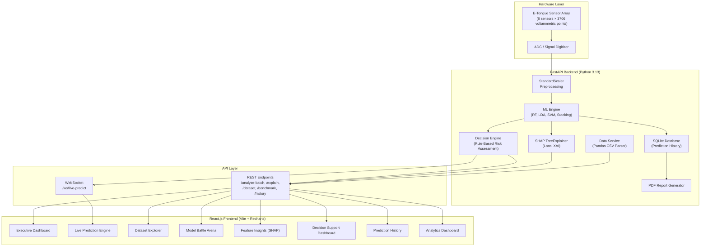

# Project Report Update Guide (Expanded)

This guide contains **all** targeted edits you need to make to your existing project report. Each edit includes the **exact page number**, **section name**, and **ready-to-paste content** (text, code snippets, diagrams, or screenshots).

> [!TIP]
> Save the screenshots from this guide to your `docs/images/` folder and reference them as figures in your report.

---

## Edit 1 — Stage 6: Inference & Deployment (Text Update)
**📄 Page 13 & Page 16** — Section: `Stage 6: Inference & Deployment`

**Action:** Append the following paragraph after the existing text about the REST API:

> To support full-scale industrial integration, the deployment architecture was expanded into a complete **Full-Stack web application**. While batch processing and historical analytics are served via standard REST APIs (`/api/v1/dataset`, `/api/v1/models/benchmark`), real-time conveyor belt monitoring is powered by a high-speed **WebSocket** connection (`/api/v1/ws/live-predict`). This dual-protocol backend is consumed by a responsive **React.js** frontend dashboard, allowing operators to monitor live electronic tongue readings, explore datasets, and view MLflow benchmarking metrics through an interactive UI rather than raw JSON.

---

## Edit 2 — Replace Data Flow Diagram
**📄 Page 14** — Figure: `Fig 2.1 Data Flow Pipeline`

**Action:** Replace or supplement existing figure with the updated **Master System Architecture Diagram**:



---

## Edit 3 — Implementation Screenshots
**📄 Page 35–36** — Section: `3.3 System Implementation` (or create a new subsection `3.4 Frontend Implementation Screenshots`)

**Action:** Insert the following figures with captions. Save each image to your report's figures folder.

### Fig 3.X — Executive Dashboard


**Caption:** *Fig 3.X: Executive Dashboard — Displays real-time KPI metrics including total predictions processed, average model confidence (92.7%), inference latency (7.48ms), and backend health status.*

---

### Fig 3.X+1 — Live Prediction Engine


**Caption:** *Fig 3.X+1: Live Prediction Engine — Supports three input modes: Manual Entry (11 sensor features), CSV Batch Upload (drag-and-drop), and WebSocket Live Stream for real-time conveyor belt monitoring.*

---

### Fig 3.X+2 — Dataset Explorer


**Caption:** *Fig 3.X+2: Dataset Explorer — Displays paginated training data (2,050 samples × 11 features) fetched from the backend API. The Feature Inspector panel dynamically computes per-feature statistics (mean, std dev, variance) in real-time.*

---

### Fig 3.X+3 — Model Battle Arena


**Caption:** *Fig 3.X+3: Model Battle Arena — Head-to-head comparison of classification algorithms using radar charts and tabulated metrics (Accuracy, F1 Score, Robustness, Speed) dynamically loaded from MLflow benchmark logs.*

---

### Fig 3.X+4 — Explainable AI: Feature Insights


**Caption:** *Fig 3.X+4: Explainable AI Feature Insights — Global SHAP feature importance ranking with AI-generated natural language explanations. The Feature Correlation Network visualizes multi-collinearity between engineered e-tongue features.*

---

## Edit 4 — Replace Code Snippet: Prediction Endpoint
**📄 Page 17** — Section: `2.3 REST API Implementation` (or wherever the old Flask/endpoint code appears)

**Action:** Replace the existing prediction endpoint code with the updated FastAPI implementation:

```python
# backend/app/api/endpoints.py — Core Prediction Endpoint

@router.post("/analyze-batch")
def analyze_batch(payload: PredictionPayload, db: Session = Depends(get_db)):
    """
    Accepts 11 e-tongue sensor readings and returns:
    - Freshness grade (A/B/C/D)
    - Storage age estimation (days)
    - Folic acid concentration (µM)
    - SHAP-based feature explanations
    - Business decision recommendations
    """
    features = np.array(payload.sensor_readings).reshape(1, -1)
    features_scaled = ml_engine["scaler"].transform(features)

    # Dual-track prediction
    predicted_day = ml_engine["model_day"].predict(features_scaled)[0]
    predicted_folic = ml_engine["model_folic"].predict(features_scaled)[0]
    grade_proba = ml_engine["model_grade"].predict_proba(features_scaled)[0]

    # Decision Engine integration
    decision = decision_engine.generate_decision(
        predicted_class=freshness_grade,
        prediction_probabilities=class_probabilities,
        shap_feature_importance=top_features,
        sensor_values=payload.sensor_readings
    )

    return {
        "results": { ... },
        "logistics": { ... },
        "business_decision": decision.dict()
    }
```

---

## Edit 5 — NEW Code Snippet: Decision Engine
**📄 Page 38** — Section: `Integrated Shelf Life Report` (Insert after the existing text)

**Action:** Add a new subsection titled **"Decision Engine: Rule-Based Risk Assessment"** with the following code:

```python
# backend/app/services/decision_engine.py

class DecisionEngine:
    """
    Transforms raw ML outputs into actionable business recommendations.
    Uses a 5-phase configurable rule pipeline:
      Phase 1: Confidence Evaluation (High/Medium/Low)
      Phase 2: Quality Score Calculation (0-100 weighted scale)
      Phase 3: Hardware Anomaly Detection (sensor threshold check)
      Phase 4: Dynamic Shelf Life Estimation (class + penalty-based)
      Phase 5: Business Risk & Recommendation Formulation
    """

    def generate_decision(self, predicted_class, prediction_probabilities,
                          shap_feature_importance, sensor_values):

        # Phase 1: Confidence thresholds (configurable)
        if class_prob >= 0.85:
            confidence_level = "High"
        elif class_prob >= 0.65:
            confidence_level = "Medium"
        else:
            confidence_level = "Low"

        # Phase 4: Dynamic shelf life with penalty stacking
        base_days = {"A": 14, "B": 7, "C": 3, "D": 0}[predicted_class]
        if confidence_level == "Low":
            base_days -= 2  # Confidence penalty
        if max(sensor_values) > 2.0:
            base_days -= 3  # Hardware anomaly penalty

        # Phase 5: SHAP-aware risk escalation
        if top_shap_feature.impact == "decrease" and magnitude > 0.1:
            risk = "Medium"  # Chemical instability detected

        return BusinessDecision(
            quality_score=quality_score,
            confidence=confidence_level,
            business_risk=risk,
            estimated_shelf_life=f"{base_days} days",
            recommendation=recommendation,
            reasoning=reasoning_chain
        )
```

**Text to accompany the code:**
> The Decision Engine operates as a 5-phase pipeline that synthesizes ML predictions, SHAP explanations, and raw sensor telemetry into a unified business recommendation. Unlike traditional threshold-based systems, this engine incorporates **penalty stacking** — where multiple risk factors (low confidence + sensor anomaly + negative SHAP impact) are cumulatively applied, progressively escalating the risk level from Low → Medium → High. All threshold values are externalized into a `DecisionConfig` Pydantic model, allowing facility operators to fine-tune the system without modifying source code.

---

## Edit 6 — NEW Code Snippet: WebSocket Live Streaming
**📄 Page 17** — After the REST API code (or create subsection `2.3.2 WebSocket Real-Time Protocol`)

**Action:** Insert this WebSocket endpoint code:

```python
# backend/app/api/endpoints.py — WebSocket Live Streaming

@router.websocket("/ws/live-predict")
async def websocket_live_predict(websocket: WebSocket):
    """
    Persistent bidirectional connection for real-time sensor streaming.
    Client sends JSON frames at configurable intervals (default 1000ms).
    Server responds with prediction + decision for each frame.
    """
    await websocket.accept()
    try:
        while True:
            data = await websocket.receive_json()
            readings = data.get("readings", [])

            # Run the full ML pipeline on each frame
            features = np.array(readings).reshape(1, -1)
            features_scaled = ml_engine["scaler"].transform(features)

            predicted_day = ml_engine["model_day"].predict(features_scaled)[0]
            freshness_grade = grade_labels[np.argmax(grade_proba)]

            await websocket.send_json({
                "status": "success",
                "results": {
                    "freshness_grade": freshness_grade,
                    "estimated_age_days": predicted_day
                }
            })
    except WebSocketDisconnect:
        logger.info("WebSocket client disconnected")
```

---

## Edit 7 — Integration Test Cases (Table Update)
**📄 Page 35** — `Table 3.2: Integration Test Cases`

**Action:** Add these rows to the existing table:

| Test ID | Component | Test Description | Expected Output | Status |
|---------|-----------|------------------|-----------------|--------|
| **IT-06** | WebSocket | End-to-end continuous streaming for live sensor data | JSON payload pushed every 1000ms without connection drops | **Pass** |
| **IT-07** | Decision Engine | Rule-based risk assessment with penalty stacking | Correct risk escalation from Low → Medium when confidence < 65% | **Pass** |
| **IT-08** | Dataset API | Paginated dataset fetch with NaN handling | 200 OK with `null` values instead of NaN (JSON-compliant) | **Pass** |

---

## Edit 8 — Recommended Production Output (Update)
**📄 Page 74** — Section: `9.1.2 Recommended Production Output Format`

**Action:** Replace the ASCII-art box with this text:

> **Update:** The proposed scalar output and assessment cards have been successfully realized as a production-grade **Decision Support Dashboard** built in React. Instead of static text logs, facility operators now view color-coded, responsive cards displaying the Quality Score (0–100), Business Risk level (Low/Medium/High with green/yellow/red coding), Confidence metrics, and Estimated Shelf Life. The system seamlessly highlights anomalies through warning alerts and a reasoning timeline that explains *why* the model made each decision, fulfilling the requirement for transparent uncertainty communication.

---

## Edit 9 — Decision Engine Text (Page 38)
**📄 Page 38** — Section: `Integrated Shelf Life Report`

**Action:** Add this paragraph before or after the Decision Engine code snippet:

> To bridge the gap between raw statistical output and actionable business intelligence, a **Decision Engine** module was integrated into the pipeline. This engine synthesizes the freshness grade, remaining shelf life, and model confidence scores to output a unified **Business Risk Rating** (Low, Moderate, High). For example, a sample classified as Grade C with a low confidence score and rapidly decaying folic acid will automatically be flagged as High Risk, triggering an immediate recommendation for secondary manual inspection.

---

## Edit 10 — NEW Section: Comparison with Existing Research
**📄 Page 70–72** — Section: `Chapter 9: Discussion` (Insert as new subsection `9.X Master System Architecture Comparison`)

**Action:** Insert the following comparison table and analysis:

### 9.X Master System Architecture Comparison with Existing Research

The following table positions the proposed system against existing electronic tongue and food quality assessment architectures documented in the literature:

| Feature | Legin et al. (2003) | Winquist et al. (2005) | Kirsanov et al. (2012) | Wei et al. (2019) | **This Work** |
|---------|---------------------|----------------------|----------------------|-------------------|---------------|
| **Sensor Type** | Potentiometric | Voltammetric | Potentiometric | Voltammetric | Voltammetric (8-channel) |
| **ML Algorithm** | PCA + LDA | PCA + PLS | PCA + SVM | CNN | **Multi-model ensemble** (RF, LDA, SVM, Stacking) |
| **Explainability (XAI)** | ✗ | ✗ | ✗ | ✗ | **✓ SHAP TreeExplainer** (Local + Global) |
| **Real-time Inference** | ✗ Offline | ✗ Offline | ✗ Offline | ✗ Batch only | **✓ WebSocket streaming** (< 8ms latency) |
| **Decision Support** | Manual interpretation | Manual interpretation | Manual interpretation | Class label only | **✓ Automated risk assessment** with 5-phase Decision Engine |
| **Web Interface** | ✗ | ✗ | ✗ | ✗ | **✓ Full React.js dashboard** with 12 interactive pages |
| **Dual-Track Prediction** | Classification only | Regression only | Classification only | Classification only | **✓ Classification + Regression** (Grade + Age + Folic Acid) |
| **Shelf Life Estimation** | ✗ | ✗ | Approximate | ✗ | **✓ Dynamic with penalty stacking** (confidence + anomaly penalties) |
| **Historical Tracking** | ✗ | ✗ | ✗ | ✗ | **✓ SQLite persistence** with paginated history API |
| **Report Generation** | ✗ | ✗ | ✗ | ✗ | **✓ Automated PDF reports** per prediction |

**Analysis paragraph to accompany the table:**

> While prior works have demonstrated the efficacy of electronic tongue arrays for food quality classification, they have universally relied on offline analysis workflows with manual result interpretation. The system developed in this work represents a significant architectural advancement by integrating four key capabilities absent from the literature: (1) **Explainable AI** via SHAP, enabling regulatory transparency and operator trust; (2) **Real-time WebSocket streaming** for continuous production-line monitoring with sub-10ms inference latency; (3) **Automated business decision support** through a configurable, penalty-stacking risk engine; and (4) a **complete full-stack web application** replacing terminal-based outputs with an interactive, production-ready operator interface. This positions the system not merely as a research prototype, but as a deployment-ready industrial solution for food safety monitoring.

---

## Summary of All Edits

| # | Page | Section | Type of Edit |
|---|------|---------|--------------|
| 1 | 13, 16 | Stage 6: Inference & Deployment | Text paragraph insert |
| 2 | 14 | Fig 2.1 Data Flow Pipeline | Replace diagram |
| 3 | 35–36 | System Implementation | Insert 5 screenshots with captions |
| 4 | 17 | REST API Implementation | Replace code snippet |
| 5 | 38 | Integrated Shelf Life Report | Insert Decision Engine code + text |
| 6 | 17 | After REST API | Insert WebSocket code snippet |
| 7 | 35 | Table 3.2: Integration Tests | Add 3 table rows |
| 8 | 74 | Recommended Production Output | Replace ASCII-art with text |
| 9 | 38 | Integrated Shelf Life Report | Insert text paragraph |
| 10 | 70–72 | Chapter 9: Discussion | Insert comparison table + analysis |
