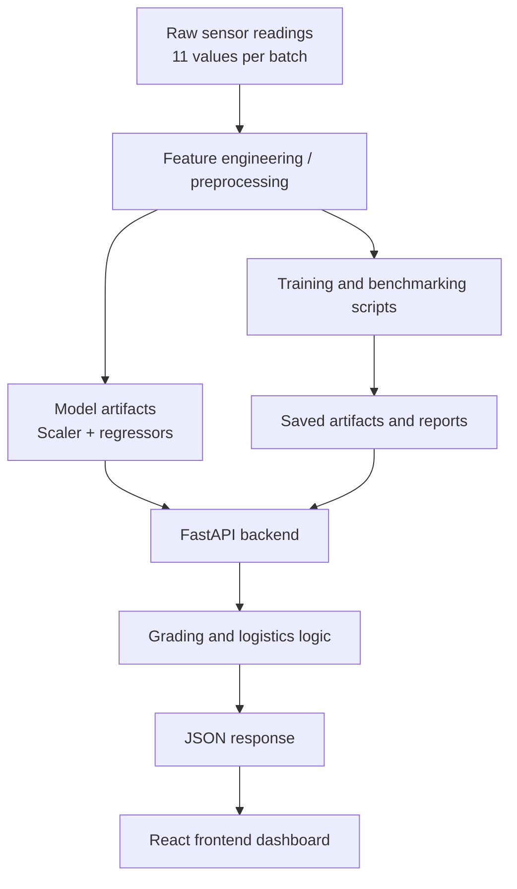

# Technical Architecture Report

## 1. Project Summary

This repository implements an orange freshness assessment system built around machine learning, with a Python backend that serves inference results and a React frontend that presents the workflow and lets users submit batches for analysis.

The project is organized around two prediction tracks:

- Track A: freshness grade classification, producing grades A/B/C/D.
- Track B: regression-based freshness logistics, producing predicted storage age and folic acid concentration.

The overall system combines feature engineering, model training, offline benchmarking, API serving, and a presentation dashboard.

## 2. High-Level Architecture

At runtime, the backend loads serialized scikit-learn artifacts from `backend/models/`, transforms incoming sensor values, runs the regressors, then converts predictions into grade, shelf-life, and nutritional-status outputs.

## 3. Repository Structure

The repository is split into three practical layers:

- `backend/`: FastAPI application and model-serving code.
- `frontend/`: React/Vite user interface for batch submission and result display.
- `src/`: research, training, preprocessing, benchmarking, and visualization utilities.

Supporting assets live in:

- `datasets/`: CSV datasets, targets, and blind-test batches.
- `docs/reports/`: project reports and documentation.
- `results/` and `outputs/`: experiment outputs, figures, and generated artifacts.

## 4. Backend Architecture

### 4.1 Application entry point

The FastAPI app is defined in `backend/app/main.py`. It configures a lifespan handler that tries to initialize the ML engine at startup and stores it in `app.state.ml_engine`.

If the serialized model artifacts are missing, startup does not fail hard; the app stores `None` and the engine is created lazily when the first request arrives.

### 4.2 API layer

The API router in `backend/app/api/endpoints.py` exposes two endpoints under the `/api/v1` prefix:

- `GET /health`: simple health probe.
- `POST /analyze-batch`: batch inference endpoint that validates input, runs the model pipeline, and returns a typed response model.

The API layer is intentionally thin. It delegates the actual business logic to the service layer.

### 4.3 ML engine

The core predictor is implemented in `backend/app/core/ml_engine.py`.

Key behavior:

- Loads three serialized artifacts from `backend/models/` by default:
  - `model_day_rf.pkl`
  - `model_folic_rf.pkl`
  - `scaler.pkl`
- Uses a singleton pattern so the model objects are loaded once per process.
- Accepts either a 1D or 2D array of sensor readings and normalizes to a 2D array internally.
- Applies the scaler and then predicts both outputs:
  - estimated storage days
  - folic acid concentration in µM

If any required artifact is missing, the loader raises `FileNotFoundError`. That behavior is useful because it makes startup problems explicit during deployment and testing.

### 4.4 Business logic / grading service

The service layer in `backend/app/services/grading_service.py` transforms raw predictions into user-facing outputs.

Responsibilities:

- Map predicted days to a freshness grade:
  - `<= 3` days: A
  - `<= 7` days: B
  - `<= 10` days: C
  - otherwise: D
- Convert folic acid concentration into a nutritional status label.
- Estimate remaining shelf life using a temperature-adjusted Q10-style correction.
- Build a confidence interval around the remaining shelf life estimate.
- Emit the final response model.

The service also adjusts confidence and remaining shelf life when the request uses the `advanced` preprocessing strategy. That is a domain heuristic layered on top of the model outputs.

### 4.5 Response contract

The request and response models are defined in `backend/app/schemas/payload.py`.

Input contract:

- `batch_id`: non-empty string.
- `sensor_readings`: exactly 11 floats.
- `preprocessing_strategy`: string, default `raw`.
- `storage_temperature_c`: float, default `4.0`.

Output contract:

- `status`
- `batch_id`
- `processing_latency_ms`
- `results`
- `logistics`

The schema uses strict validation and `extra = "forbid"`, so unexpected fields are rejected rather than ignored.

## 5. Frontend Architecture

The frontend is a Vite-powered React application defined under `frontend/`.

### 5.1 App shell

`frontend/src/App.jsx` is the main container. It renders:

- a hero section describing the project,
- an interactive inference form,
- a results dashboard,
- a pipeline explanation section,
- dataset and artifact maps.

It also manages API submission state:

- loading state
- error state
- prediction response state

### 5.2 Inference form

`frontend/src/components/InferenceForm.jsx` collects:

- batch ID,
- preprocessing strategy,
- storage temperature,
- 11 sensor readings.

The form can auto-fill mock readings for a demonstration flow, then sends a JSON payload that matches the backend schema.

### 5.3 Results dashboard

`frontend/src/components/ResultsDashboard.jsx` renders the returned JSON into a human-friendly report card.

It separates results into two bands:

- Quality metrics: grade, description, folic acid, nutritional status.
- Logistics action block: remaining shelf life, confidence score, estimated age, confidence interval.

It also highlights temperature risk when the backend reports a warning.

### 5.4 API client

`frontend/src/api/inferenceApi.js` wraps `fetch` calls to the backend endpoints.

The client centralizes error parsing so backend failures are converted into readable messages in the UI.

## 6. Machine Learning Pipeline

### 6.1 Track B regression pipeline

The deployed backend path is a regression system that predicts two values from the same sensor vector:

- predicted days since harvest / storage age
- predicted folic acid concentration

The service layer then converts those predictions into freshness grade and logistics guidance.

The predictor class in `backend/app/core/ml_engine.py` expects the trained scaler and two regression models to already be serialized.

### 6.2 Track A classification pipeline

The `src/training/`, `src/preprocessing/`, and `src/inference/` directories contain a separate but related Track A pipeline for freshness grade classification.

That pipeline follows this sequence:

1. Start from raw optical sensor signals.
2. Smooth the signal with Savitzky-Golay filtering.
3. Extract engineered features, especially DCT coefficients and summary statistics.
4. Impute missing values and scale features.
5. Run RFE to select the most useful features.
6. Train a stacking classifier.
7. Persist the model, scaler, imputer, and metadata.

The key files are:

- `src/preprocessing/track_a_preprocessing.py`
- `src/preprocessing/track_a_preprocessing_v2.py`
- `src/preprocessing/track_a_feature_selection.py`
- `src/training/track_a_train_classifier.py`
- `src/inference/track_a_inference.py`

This Track A code is useful for experimentation and future improvements, even though the FastAPI backend currently serves the Track B regression path.

### 6.3 Enhanced feature generation

`src/preprocessing/generate_enhanced_features.py` derives `datasets/X_features_enhanced.csv` from the baseline feature table.

It adds amplitude, spread, gradient, entropy, and interaction-style features to enrich the representation before retraining.

That script reflects the project’s attempt to improve classification confidence through more expressive features.

## 7. Benchmarking and Reporting Layer

The benchmarking layer lives in `src/benchmarking/`.

`src/benchmarking/tournament_director.py` compares multiple models and preprocessing strategies across both tracks.

The benchmarking design includes:

- raw preprocessing versus advanced preprocessing,
- classification models for freshness grade,
- regression models for shelf-life prediction,
- summary CSV output,
- generated plots for presentation and comparison.

This layer is separate from the production API. Its role is to evaluate model families and produce evidence for the reports in `docs/reports/` and the figures in `outputs/`.

`src/visualization/presentation_dashboard.py` converts results into presentation-ready charts such as:

- confusion matrices,
- regression parity plots,
- feature importance views,
- architecture diagrams,
- data split summaries.

## 8. Data Layout

The project keeps the data assets under `datasets/`.

Important files and folders include:

- `X_features.csv`: baseline engineered features.
- `X_features_enhanced.csv`: richer feature table for newer experiments.
- `y_targets.csv`: labels and numeric targets.
- `test_dataset_blind/`: unseen batches for blind evaluation.
- `preprocessed_blind_test/`: preprocessed blind-test outputs.

This layout supports reproducible experiments because the training scripts can consume stable CSV artifacts instead of raw sensor files every time.

## 9. Testing Strategy

The repository includes backend tests in `tests/`.

`tests/test_api.py` verifies:

- the health endpoint,
- batch inference success,
- behavior of the `advanced` preprocessing strategy,
- validation failure for malformed sensor input.

`tests/test_services.py` verifies the grading and shelf-life helper functions directly.

These tests are focused and unit-level. They validate the request/response contract and the business rules around shelf-life conversion.

## 10. Dependency Model

The backend depends on FastAPI, Pydantic, NumPy, Pandas, SciPy, scikit-learn, Joblib, PyTest, and HTTPX.

The frontend uses React 18 and Vite.

The `src/` research layer additionally references ML and visualization tooling such as XGBoost, TensorFlow, Matplotlib, and Seaborn in the benchmarking/reporting code.

## 11. Important Implementation Notes

- The backend schema requires exactly 11 sensor readings. That is a hard validation rule, not a soft convention.
- The backend ML engine currently loads regression artifacts from `backend/models/` and fails loudly if they are absent.
- There are legacy and experimental modules in `src/` that overlap conceptually with the deployed backend. That is normal for a research project, but it means not every script is part of the runtime API path.
- The frontend is a presentation and interaction layer; it does not do local ML inference.
- The documentation folder already contains multiple reports, so this file should be treated as the technical architecture summary rather than the only source of project context.

## 12. Practical Architecture Summary

In one sentence: raw sensor readings enter the system through the React form or API client, the FastAPI backend validates and transforms the data, regression models estimate age and folic acid, the service layer converts those estimates into freshness and logistics guidance, and the frontend renders the final assessment for the user.

## 13. Maintenance Opportunities

The codebase would benefit from a few cleanup steps:

- Consolidate the two `OrangeFreshnessPredictor` implementations so there is one canonical serving path.
- Align the README wording with the current backend behavior and artifact locations.
- Keep the production API path and the research scripts clearly separated in future documentation.
- Add a small deployment note explaining which files in `backend/models/` are required at runtime.
